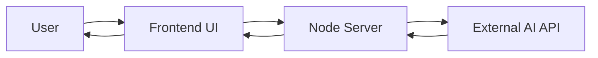
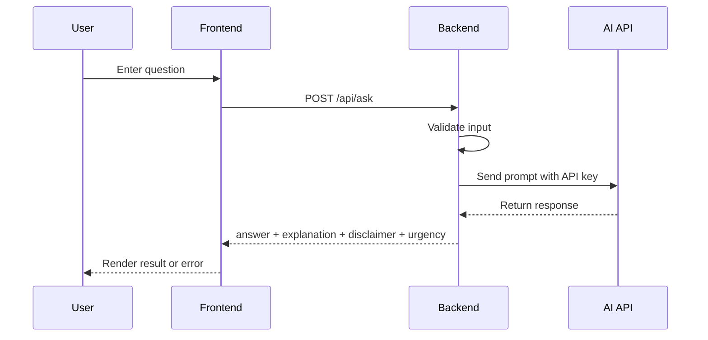

# AIcura

AIcura is a web-based retinal insight platform in development. The long-term goal is to analyze retinal scans with AI to estimate broader health factors, including heart-health and diabetes-related patterns.

The current live feature is a health and retinal-related question-answering assistant that sends user questions to an external AI API and returns an educational response with explanation, care guidance, and disclaimer.

This project does **not** build its own AI model from scratch. It integrates existing AI APIs through backend routes.

## MVP Scope

- Working frontend with a prompt input, roadmap messaging, and result display
- Working backend with a `POST /api/ask` route
- Frontend and backend connected end-to-end
- One external AI API integration for live health Q&A
- Basic validation and failure handling
- Educational disclaimer on every response
- Retinal scan upload, heart-health analysis, and diabetes analysis presented as planned next phases

## Tech Stack

- Frontend: HTML, CSS, vanilla JavaScript
- Backend: Node.js built-in HTTP server
- AI integration: OpenAI Chat Completions API
- Configuration: `.env` file

## Requirements Covered

- User enters a health-related or retinal-related question in the frontend
- Backend validates the request and calls the AI API
- AI response is returned to the frontend and displayed
- Invalid input is handled gracefully
- API failures are surfaced with a user-friendly error message
- Output includes a simple explanation, care guidance, and disclaimer
- Home page explains the future retinal upload, heart-health model, and diabetes model roadmap

## Architecture Diagram



## Request Flow



## Local Setup

1. Copy `.env.example` to `.env`.
2. Add a valid `OPENAI_API_KEY`.
3. Run `npm start`.
4. Open `http://localhost:3000`.

Example `.env`:

```env
OPENAI_API_KEY=your_openai_api_key_here
OPENAI_MODEL=gpt-4o-mini
PORT=3000
```

## Demo Script

1. Open the landing page and explain the project in one sentence.
2. Open the chat page.
3. Enter a sample health question.
4. Show that the frontend sends the request to the backend.
5. Show the AI response, explanation, urgency, and disclaimer.
6. Trigger one error case, such as empty input or a missing API key.
7. Show this README and the diagrams in GitHub.

## Suggested Demo Questions

- How can retinal scans be used to study diabetes-related patterns?
- Can a retinal image reveal anything about heart health?
- What are common reasons for blurry vision, and when could it be urgent?

## Project Structure

```text
CapStone/
  index.html
  chat.html
  server.js
  package.json
  .env.example
  README.md
```

## Important Note

AIcura is for educational purposes only. It does not diagnose medical conditions, prescribe treatment, or replace licensed healthcare professionals. The current app does not store submitted questions on the AIcura server, and retinal images should be treated as sensitive medical data.
