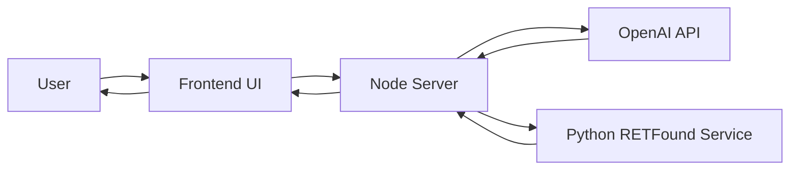
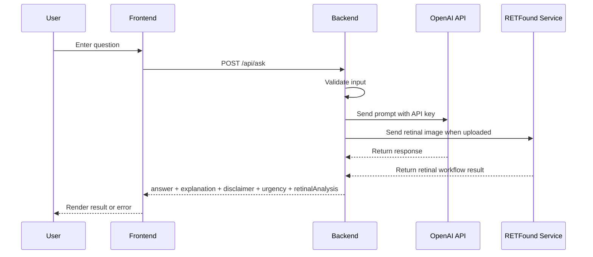

# AIcura

AIcura is a web-based retinal insight platform in development. The long-term goal is to analyze retinal scans with AI to estimate broader health factors, including heart-health and diabetes-related patterns.

The current live feature is a health and retinal-related question-answering assistant that sends user questions to an external AI API and returns an educational response with explanation, care guidance, and disclaimer. The repo now also includes a separate Python retinal-analysis service with:
- retinal-vs-non-retinal image validation
- optional diabetes-screening output for valid fundus images
- a RETFound-compatible heart-analysis path that is ready for a task-specific checkpoint

This project does **not** build its own AI model from scratch. It integrates existing AI APIs through backend routes.

## MVP Scope

- Working frontend with a prompt input, roadmap messaging, and result display
- Working backend with a `POST /api/ask` route
- Frontend and backend connected end-to-end
- One external AI API integration for live health Q&A
- Basic validation and failure handling
- Educational disclaimer on every response
- Retinal scan upload connected to a separate Python analysis service
- Non-retinal uploads rejected before retinal analysis runs
- Diabetes-screening output shown for valid fundus images
- Heart-analysis path prepared for a future task-specific RETFound checkpoint

## Tech Stack

- Frontend: HTML, CSS, vanilla JavaScript
- Backend: Node.js built-in HTTP server
- Retinal analysis service: FastAPI (Python)
- Retinal image validation: CLIP zero-shot + fundus quality ensemble
- Diabetes branch: public diabetic-retinopathy checkpoint
- AI integration: OpenAI Chat Completions API
- Configuration: `.env` file

## Requirements Covered

- User enters a health-related or retinal-related question in the frontend
- Backend validates the request and calls the AI API
- AI response is returned to the frontend and displayed
- Invalid input is handled gracefully
- API failures are surfaced with a user-friendly error message
- Output includes a simple explanation, care guidance, and disclaimer
- Home page explains the future retinal upload, heart-health model, and diabetes model roadmap

## Architecture Diagram



## Request Flow



## Running Locally

1. Install the Node side:
   ```bash
   npm install
   ```
2. Install the retinal service side:
   ```bash
   python -m pip install -r retfound_service/requirements.txt
   ```
3. Create `.env` from `.env.example` and add your OpenAI key.
4. Start the Python retinal service:
   ```bash
   npm run retfound:start
   ```
5. In a second terminal, start the Node app:
   ```bash
   npm start
   ```

By default, the retinal service:
- validates whether an uploaded image looks like a retinal fundus image
- adds a fundus-quality note when it can
- enables the diabetes branch through a public checkpoint
- keeps the heart RETFound branch in placeholder mode until a task-specific checkpoint is added
- may take 30-45 seconds on the first real retinal upload, depending on model loading and hardware

## Real RETFound Mode

- The retinal validator can reject obvious non-fundus uploads before retinal analysis runs.
- The diabetes branch can provide educational diabetic-retinopathy stage output for valid retinal images.
- Real RETFound heart inference still needs a separate task-specific checkpoint.
- Set these `.env` values before switching modes:
  - `RETFOUND_MODE=retfound`
  - `RETFOUND_HEART_CHECKPOINT=/absolute/path/to/your/task-specific-checkpoint.pth`
  - `RETFOUND_CLASS_LABELS=class_a,class_b,...`
- A pretrained retinal foundation model alone is not enough for heart-health prediction. You still need a task-specific checkpoint or fine-tuned model for your chosen heart-risk labels.


## Demo Script

1. Open the landing page and explain the project in one sentence.
2. Open the chat page.
3. Ask one sample health question to show the Q&A flow.
4. Upload a non-retinal image in retinal mode and show that the validator rejects it.
5. Upload a retinal image in retinal mode and show the validation block, diabetes output, and heart-checkpoint placeholder.
6. Point out the educational disclaimer and that the result is not a diagnosis.
7. Show this README and the diagrams in GitHub.

## Suggested Demo Questions

- How can retinal scans be used to study diabetes-related patterns?
- Can a retinal image reveal anything about heart health?
- What are common reasons for blurry vision, and when could it be urgent?

